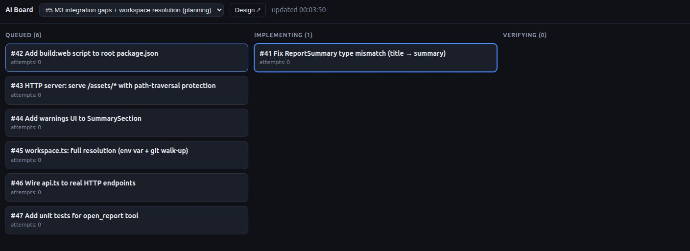

# AI Board

A live planning board for agentic development. Your idea becomes a spec, a
capable planning agent turns that spec into tickets, and smaller execution
agents pick up those tickets one by one — you watch and approve.



---

## Vision — AI spec-driven development

AI Board is built around a simple idea: use a capable agent for the hard
planning work — clarifying intent, writing the design, and breaking it into
tickets with acceptance criteria — then let smaller, cheaper agents pick up
those bounded tickets one at a time.

One spec owns one logical board of self-contained tickets. A single SQLite
database may contain multiple specs.

---

## How it works

Three AI skills drive the workflow:

**1. `board-brainstorming`** — Explores your idea, asks clarifying questions,
writes a spec, and saves it to the board.

**2. `board-planning`** — Reads the spec and breaks it into self-contained
tickets. Each ticket has a `description` (what to build) and
`acceptance_criteria` (real shell commands that must pass — never prose). Opens
the live board so you can review every ticket before execution starts.

**3. `board-execute`** — Works through tickets in order. For each ticket it
uses the complete ticket returned by `abd next`, dispatches a fresh sub-agent
(clean context, no baggage from prior tickets), runs the acceptance criteria
for real, and marks the ticket done. The normal execution loop does not fetch
the parent spec. If something fails three times or hits genuine ambiguity, it
stops and asks you.

`using-ai-board` is the bootstrap skill that establishes this three-skill
workflow and its recovery rules.

You can watch the whole thing on the live board at `http://localhost:4141`.

---

## Install

### Claude Code

```text
/plugin marketplace add backroomlabs/ai-board
/plugin install ai-board@ai-board
```

Then install the `abd` binary:

```bash
curl -fsSL https://raw.githubusercontent.com/backroomlabs/ai-board/main/install.sh | sh
```

### Codex, Cursor, or anything reading `~/.agents/skills`

```bash
curl -fsSL https://raw.githubusercontent.com/backroomlabs/ai-board/main/install.sh | sh
```

Installs `abd` to `~/.local/bin` and the four skills to `~/.agents/skills`.

### From source

```bash
cargo install ai-board   # binary is named `abd`
# or
cargo build --release    # binary at target/release/abd
```

---

## Usage

Start a new project:

```
/board-brainstorming
```

The agent guides you through the whole flow. Open `http://localhost:4141` when
prompted to review the plan, then say yes to start execution.

---

## Live board

```bash
abd serve   # http://localhost:4141
```

Five columns: `queued → implementing → verifying → done` + `needs_human`.
Cards move across as the agent works. Click any card to see its description,
acceptance criteria, and (if blocked) the question the agent is asking. The
`needs_human` column is where you intervene.

Click any card to drill into its full description and criteria. Specs and ticket
content are editable directly from the board.

---

## `abd` CLI reference

The `abd` binary is the only thing that touches the database. Commands emit JSON
to stdout except `abd spec get`, which emits raw spec content. Errors go to
stderr as `{"ok":false,"error":"..."}` with a non-zero exit code.

| Command | What it does |
|---|---|
| `abd init` | Create the schema (idempotent) |
| `abd spec add --title T (--file PATH \| --stdin)` | Save a spec |
| `abd spec list` | List all specs (JSON array, newest first) |
| `abd spec get SPEC_ID` | Print the raw spec content |
| `abd ticket add --spec-id ID --title T --description "..." --criteria '[...]'` | Add a self-contained ticket |
| `abd next [--spec-id ID]` | Atomically claim the oldest queued ticket |
| `abd ticket show TICKET_ID` | Show ticket JSON only |
| `abd ticket list --spec-id ID` | List all tickets for a spec |
| `abd update TICKET_ID --status S [--context "..."] [--bump-attempts]` | Update a ticket |
| `abd needs-human [--spec-id ID]` | Get the blocked ticket, if any |
| `abd serve [--port 4141]` | Start the live board UI (idempotent) |

`$BOARD_DB` sets the database path (default `./board.db`).

---

## Demo

```bash
demo/demo.sh                 # build, serve UI, run the full loop
DEMO_SLEEP=0.4 demo/demo.sh  # faster
NO_SERVE=1 demo/demo.sh      # headless
```

Runs the full state machine — including a ticket that fails three times, escalates
to `needs_human`, and resumes after a simulated crash — against a live board you
can watch.

---

## License

MIT — see [LICENSE](LICENSE). `board-brainstorming` and `board-planning` derive
from [Superpowers](https://github.com/obra/superpowers) (MIT, Jesse Vincent);
see [LICENSE-NOTICE.md](LICENSE-NOTICE.md) and [LICENSE.superpowers](LICENSE.superpowers).
